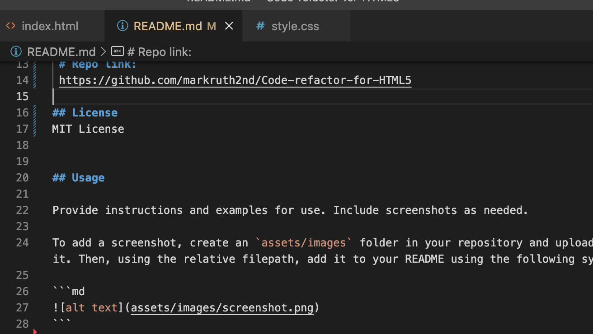

# Code Refactor

## Description

The aim of this project was to refactor an older, supplied code for HTML5 by including Semantic HTML elements throughout the source code, ensuring the HTML elements follow a logical structure independent of styling and positioning. If there are any requirements for alt attributes for any applicable elements, to ensure these are added or amended, ensuring any heading atteibutes within the code fall in sequential order and title elements contain a concise, descriptive title. 
This is should make the code more readable to anyone else who comes along looking to make any changes to the code or just understand the code. This should also make the code faster to process in the browser. 

I have created a repo to store any updates through out the process to ensure I can go back to an previous version if I do mess this up and I will also use it to make the website Live once I have completed the task.

# Deployed Link:
 https://markruth2nd.github.io/Code-refactor-for-HTML5/

 # Repo link:
 https://github.com/markruth2nd/Code-refactor-for-HTML5

## License
MIT License 


## Usage

I have provided screenshots of the process below:



```